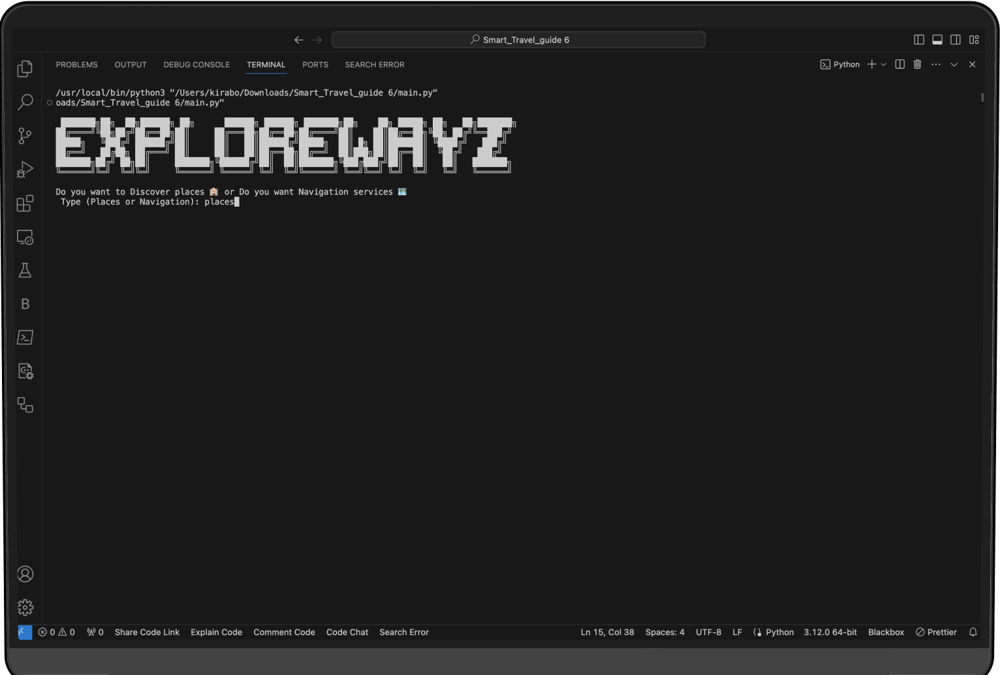
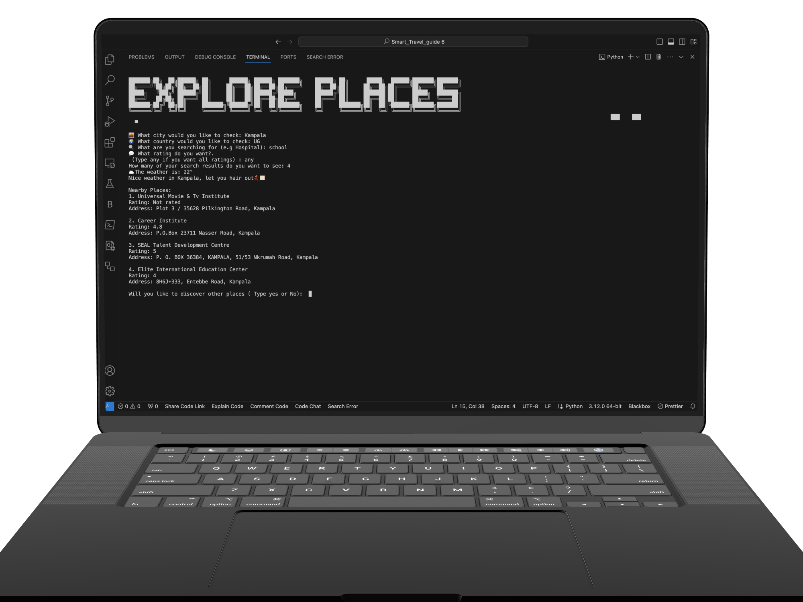
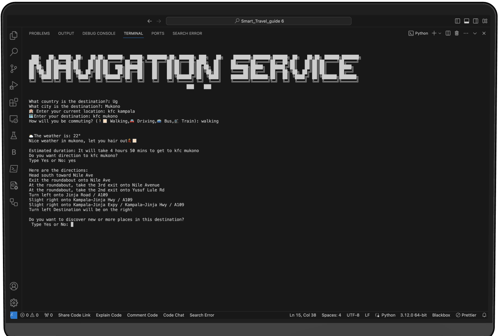

# Explorewayz

Explorewayz is a Python application designed to facilitate efficient trip planning by providing users with a unified solution for location information, real-time weather updates, and recommendations for places like restaurants. The application leverages various APIs such as Google Maps and OpenWeatherMap to offer users a seamless experience in exploring and adapting to new locations effortlessly.

## Features

- **Location Coordinates Retrieval:** Utilizes the Google Maps API to retrieve the coordinates (latitude and longitude) of a specific place.
- **Logging Coordinates:** Logs the coordinates of a place to a text file for future reference.
- **Discover Nearby Places:** Fetches nearby places based on user-input coordinates, search query, user rating preference, and number of results.
- **Display Nearby Places:** Presents a list of nearby places along with their ratings and addresses.
- **Weather Check:** Provides weather information for a given city and country, offering insights into the current weather conditions.
- **Directions and Navigation:** Offers directions between two locations based on user input, utilizing the Google Maps Directions API.
- **User Interaction:** Engages users through interactive prompts for discovering new places and navigation services.

## Dependencies

- Python
- Requests library: For making HTTP requests to web servers or APIs.
- BeautifulSoup library: For HTML parsing and cleaning up HTML/XML documents.
- dotenv library: For loading environment variables from a .env file.
- os module: For interacting with the operating system

## Getting Started

1. Download the Explorewayz documentation zip file, extract the file upon download, and open the index HTML in the build folder.
2. Clone the repository or download the codes in the merged folder.
3. Ensure Python is installed on your machine.
4. Install the required dependencies by running.
5. Set up necessary API keys:
    - Obtain a Google Maps API key and OpenWeatherMap API key.
    - Create a `.env` file and store these keys:
        ```
        GOOGLE_MAPS_API_KEY_PLACES=your_google_maps_api_key
        GOOGLE_MAPS_API_COORDINATES=your_google_maps_api_key
        WEATHER_API_KEY=your_openweathermap_api_key
        ```
6. Run the main script `main.py`.
7. Ensure the `function.py` file is loaded whilst running the `main.py`
8. Follow the on-screen prompts to explore places or utilize navigation services.


## Usage

- Upon running the application, users are prompted to choose between discovering places or navigation services.
- For discovering places, users can input a city, country, search query, user rating preference, and number of results to display.
- Navigation services offer directions between two locations and the option to explore places in the destination.


## Output
 
 

## Flow Charts
### App Flow Chart


### Code Structure


## Contributors

- Oluwatobi
- Kafayat
- Cynthia
- Aishat
- Zione

